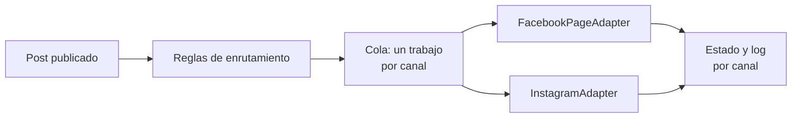
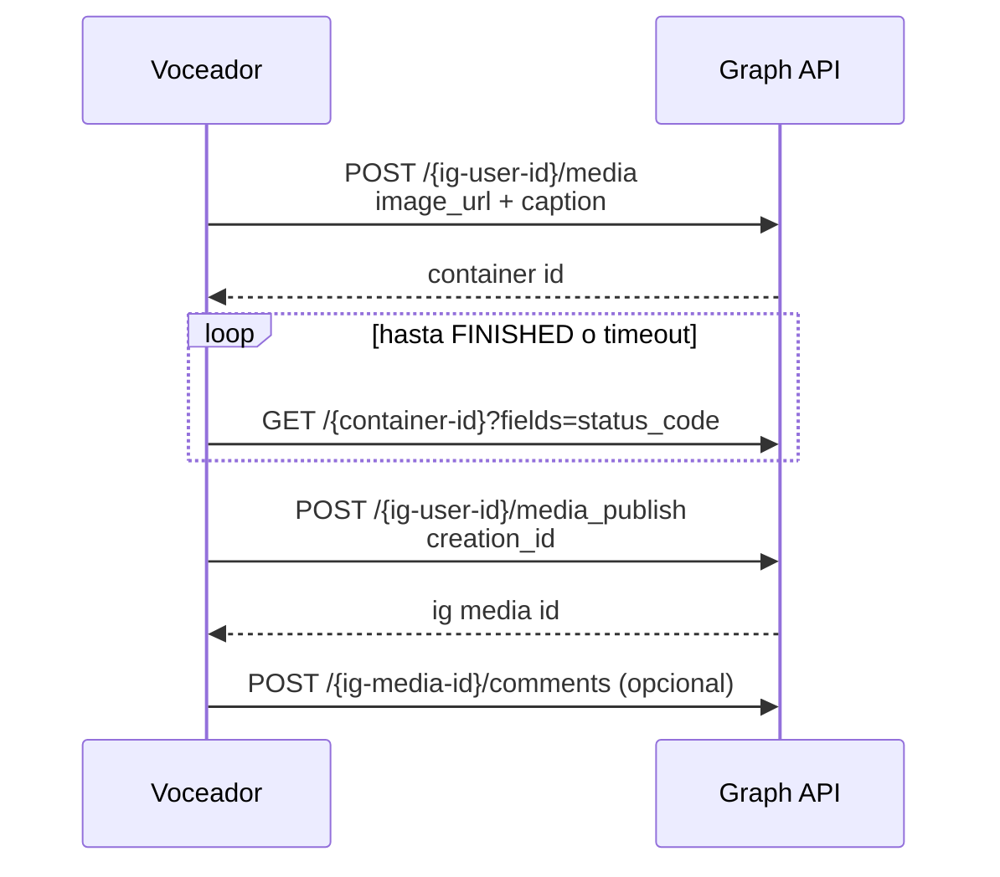

# Voceador — Prompt de desarrollo del plugin

2026-09-21 · @Someone

## Objetivo

Construye **Voceador**, un plugin de WordPress que anuncia automáticamente en Facebook e Instagram cada nota que se publica por primera vez en un sitio de noticias. Se instalará en varios sitios independientes de una red de medios, así que todo comportamiento debe ser configurable desde la interfaz y la primera instalación debe guiarse con un wizard.

Al publicarse un post, el plugin hace lo siguiente en cada canal que le corresponda:

- **Página de Facebook**: publica la imagen destacada como foto, con un caption generado desde una plantilla, y después deja un comentario de la propia Página con el enlace a la nota.
- **Cuenta de Instagram**: publica la imagen destacada (adaptada a los requisitos de Instagram) con un caption desde plantilla y, opcionalmente, un primer comentario. Como en Instagram los enlaces no son clickeables, el plugin genera una página de "link en bio" en WordPress.

No uses valores fijos en el código salvo defaults razonables. Verifica endpoints, permisos, límites y versiones de la Graph API contra la documentación vigente de Meta antes de implementarlos, y mantenlos configurables porque cambian con frecuencia.

Antes de escribir código, presenta un plan de arquitectura y el esquema de datos (opciones, metas y tablas) y espera mi confirmación.

## Stack y convenciones

PHP 8.1+ y WordPress 6.4+, compatible con instalaciones individuales y con Multisite.

- **Multisite**: configuración independiente por sitio. Si se activa en red, permite defaults de red que cada sitio puede sobrescribir.
- **Dependencias**: sin Composer salvo que sea imprescindible; usa `wp_remote_*` para HTTP. Si hace falta cola, usa Action Scheduler cuando esté disponible.
- **Código**: orientado a clases, namespace `Voceador`, prefijo `voceador_` para opciones, metas, hooks y tablas, definido en una constante.
- **Seguridad**: sanitización, escapes, nonces y capacidades. Capacidad propia `voceador_manage` (asignada a administradores por defecto) para ajustes, y `edit_post` para acciones por post.
- **Idioma**: interfaz en español, preparada para i18n con el text domain `voceador`.
- **Extensibilidad**: filtros y acciones `voceador_caption`, `voceador_comment`, `voceador_image`, `voceador_should_publish`, `voceador_target_channels`, `voceador_published` y `voceador_failed`.
- **Nombre público**: "Voceador – Autopublicación de notas en redes sociales". No uses marcas de Meta al inicio del nombre ni del slug.

## Arquitectura de canales

El concepto central es el **canal**: un destino de publicación con tipo, credenciales, reglas, plantillas y estado de salud propios. Reglas, plantillas, estado por post, logs, reintentos, notificaciones, WP-CLI, import/export y wizard operan sobre canales.

- Tipos iniciales: `facebook_page` e `instagram_account`.
- Interfaz `ChannelAdapter` con: validar credenciales, preparar medios, publicar, comentar, consultar estado y consultar límites de uso. Implementaciones `FacebookPageAdapter` e `InstagramAdapter`.
- Agregar otra red después (Threads, Bluesky, X) no debe requerir tocar el núcleo.
- Un post puede ir a varios canales; cada combinación post + canal es un trabajo independiente y un fallo en uno no bloquea a los demás.

Cada post pasa por las reglas, que deciden sus canales; la cola ejecuta un adaptador por canal y registra el resultado.

## Conexión con Facebook

Cada sitio usa una app de Meta (App ID + App Secret) y puede conectar varias Páginas. Una misma app puede servir a varios sitios si se registra la redirect URI de cada uno; documenta ambas opciones.

Por cada Página guarda: Page ID, nombre, Page Access Token, permisos concedidos, fecha de conexión y estado de salud. La versión de Graph API es configurable.

### Almacenamiento seguro

- App Secret y tokens se guardan cifrados con libsodium. La clave se deriva de `AUTH_KEY`/`SECURE_AUTH_KEY`, o de la constante `VOCEADOR_ENCRYPTION_KEY` si existe en `wp-config.php`.
- Opciones con autoload desactivado. Nunca muestres los secretos completos ni los escribas en logs.

### Método A: OAuth (recomendado)

1. El usuario ingresa App ID y App Secret.
2. El plugin muestra la redirect URI exacta que debe registrarse en la app (Facebook Login → Settings → Valid OAuth Redirect URIs), con botón de copiar.
3. Botón "Conectar con Facebook" abre el diálogo OAuth con parámetro `state` (nonce) y los permisos `pages_show_list`, `pages_read_engagement`, `pages_manage_posts`, `pages_manage_engagement` y `business_management` (necesario si las Páginas están en un Business Manager). Si se van a conectar cuentas de Instagram vinculadas, agrega `instagram_basic`, `instagram_content_publish` e `instagram_manage_comments`.
4. En el callback: intercambia `code` por user token, extiéndelo a token de larga duración (`fb_exchange_token`) y lista las Páginas con `GET /me/accounts`. Los Page tokens derivados de un user token de larga duración no expiran.
5. El usuario elige qué Páginas conectar y les pone un alias interno. El user token no se conserva.

### Método B: token manual

- Campo para pegar un user token o Page token generado en el Graph API Explorer.
- Si es user token, el plugin lo extiende y lista las Páginas; si es Page token, lo valida y lo guarda.

### Salud de los tokens

- Valida todo token con `GET /debug_token` y muestra tipo, Página, permisos concedidos, permisos faltantes y expiración.
- Cron diario que revisa cada token. Si uno deja de ser válido (cambio de contraseña, admin removido, permisos revocados), muestra un aviso persistente, envía correo según configuración y pausa ese canal sin afectar a los demás.
- Botón "Reconectar" por canal.

## Conexión con Instagram

Solo se admiten cuentas de Instagram profesionales (Business o Creator), conectadas por uno de dos métodos.

### Método 1: Instagram vinculado a una Página de Facebook

- Reutiliza la app y el OAuth de Facebook con los permisos de Instagram indicados arriba.
- Tras conectar las Páginas, consulta `GET /{page-id}?fields=instagram_business_account{id,username,profile_picture_url}` y ofrece conectar las cuentas encontradas.
- Usa el Page Access Token de la Página vinculada, que no expira.

### Método 2: Instagram Login (sin Página de Facebook)

- OAuth de Instagram con los permisos `instagram_business_basic`, `instagram_business_content_publish` e `instagram_business_manage_comments`.
- Intercambia por token de larga duración (60 días) y renuévalo automáticamente con un cron (`refresh_access_token`) antes de que expire. Si la renovación falla, avisa y pausa el canal.
- Redirect URI propia, mostrada en el wizard con botón de copiar.

### En ambos métodos

- Tokens cifrados y cron de salud igual que en Facebook.
- Guarda por cuenta: IG user ID, username, foto de perfil, método de conexión y fecha de expiración del token si aplica.

## Publicación en Facebook

La publicación en una Página se hace en dos llamadas: la foto con su caption y, después de un retraso configurable, el comentario con el enlace.

1. `POST /{page-id}/photos` con `caption` y la imagen.
   - Por defecto, envía el archivo en multipart (`source`), leyendo el adjunto local; así funciona detrás de CDN, WAF o en sitios no públicos.
   - Alternativa configurable: enviar `url`.
   - Valida formato y peso; si excede, usa un tamaño menor automáticamente.
2. Toma el `post_id` de la respuesta (no el `id` de la foto) y guárdalo.
3. Tras el retraso configurado (default 60 s), `POST /{post_id}/comments` con el Page token para que el comentario aparezca como la Página.
4. Si el paso 1 funcionó y el 3 falló, reintenta solo el comentario.

Sin imagen destacada, aplica el comportamiento configurado: omitir, usar una imagen por defecto o publicar como enlace en `/{page-id}/feed`.

## Publicación en Instagram

Instagram publica a partir de un contenedor que descarga la imagen desde una URL pública, así que el plugin debe preparar y exponer una versión de la imagen apta para Instagram.

El sondeo del contenedor tiene timeout y reintentos; `ERROR` o `EXPIRED` terminan el trabajo con un error visible. Tras publicar, guarda el `ig_media_id` y su `permalink`.

### Imagen

- **URL pública obligatoria**: Instagram no acepta subida directa. Sirve la imagen desde uploads o desde un endpoint REST temporal del plugin con URL firmada y expirable.
- En el wizard y en la prueba de conexión, verifica que la URL sea accesible desde fuera; avisa si el sitio está en local, detrás de autenticación o con un WAF/CDN que bloquee a los rastreadores de Meta.
- **Formato**: JPEG. Convierte PNG, WebP o AVIF.
- **Relación de aspecto**: Instagram acepta aproximadamente de 4:5 a 1.91:1. Fuera de ese rango, aplica la estrategia configurada por canal: recortar (centro o punto focal), rellenar (color de marca o la misma imagen desenfocada de fondo) u omitir con aviso.
- Proporción de salida (1:1, 4:5 o 1.91:1), resolución máxima y peso máximo configurables.
- Cachea la imagen generada por post y regénerala si cambia la destacada.
- Campo opcional en el editor "Imagen para Instagram" que sobrescribe la destacada.

### Caption y primer comentario

- Valida los límites de Instagram (caracteres del caption, número de hashtags y menciones); recorta de forma inteligente y avisa en la vista previa.
- Hashtags generados desde etiquetas o categorías, con mapa etiqueta→hashtag, máximo y lista de exclusión. Opción de colocarlos en el caption o en el primer comentario.
- Primer comentario opcional con plantilla propia. La interfaz advierte que los enlaces no son clickeables en Instagram.

### Límites de uso

- Consulta `GET /{ig-user-id}/content_publishing_limit` antes de publicar.
- Si se alcanzó el límite de 24 h, reprograma el trabajo para cuando haya cupo y muéstralo en el estado.
- Muestra el uso actual por cuenta en los ajustes.

### Fase opcional

- Carrusel con imágenes de la galería del post (hasta 10).
- Historia con la imagen destacada.

## Página de link en bio

El plugin genera una página pública (slug editable, por ejemplo `/ig`) con las últimas notas publicadas en cada cuenta de Instagram, en el mismo orden que el feed, para enlazarla desde la bio del perfil.

- Cada tarjeta muestra imagen, título y enlace; opción de usar la imagen generada para Instagram para que coincida visualmente con el feed.
- Una página por cuenta o una compartida, según configuración.
- Parámetros UTM propios (por ejemplo `utm_source=instagram`).
- Plantilla sobrescribible desde el tema (`voceador/link-in-bio.php`), estilos mínimos compatibles con modo oscuro, carga rápida en móvil y sin dependencias externas.
- El wizard muestra la URL resultante para copiarla a la bio.

## Configuración

Todo se configura por canal, con valores globales que cada canal puede sobrescribir.

### Reglas de enrutamiento

- Por canal: activar o desactivar, post types, y filtros de inclusión o exclusión por categorías, etiquetas o taxonomías personalizadas.
- Un post puede ir a varios canales. La selección manual en el editor sobrescribe las reglas.

### Plantillas

- Plantillas de caption y de comentario por canal.
- Marcadores: `{social_message}`, `{title}`, `{excerpt}`, `{permalink}`, `{shortlink}`, `{site_name}`, `{author}`, `{category}`, `{categories}`, `{tags_hashtags}`, `{date}` y, para Instagram, `{link_in_bio_text}`.
- Cadena de fallback configurable para `{social_message}` (por ejemplo: texto social → extracto → título).
- Parámetros UTM configurables por canal, con marcadores.
- Límite de longitud por canal; limpieza de HTML, shortcodes y entidades.

### Imagen

- Tamaño de imagen para Facebook (lista de tamaños registrados) y modo de envío (archivo o URL).
- Proporción, estrategia de ajuste y tamaño para Instagram (ver publicación en Instagram).
- Comportamiento sin imagen destacada e imagen por defecto.

### Ejecución

- Retraso antes de publicar (default 30 s) y entre publicación y comentario (default 60 s).
- Comentario activado o desactivado por canal.
- Número de reintentos y backoff.
- Si se publican también posts programados (`future` → `publish`) y posts antiguos republicados manualmente.

### Importar y exportar

- Exporta toda la configuración a JSON sin secretos ni tokens, e impórtala en otro sitio para replicarla en la red de medios.

## Integración con el editor

El editor tiene un panel "Redes" donde la redacción escribe el texto social, elige canales y ve el resultado final antes de publicar.

- Metas registrados con `register_post_meta` (`show_in_rest: true`, `single: true`, `auth_callback`): `_voceador_message_fb`, `_voceador_message_ig`, `_voceador_skip`, `_voceador_channels` e `_voceador_ig_image`.
- Editor de bloques: panel `PluginDocumentSettingPanel` con textos separados para Facebook e Instagram (opción "usar el mismo texto"), contador de caracteres, checkbox "No publicar en redes", selector de canales preseleccionados según las reglas, vista previa del caption final y miniatura del recorte para Instagram.
- Editor clásico: meta box equivalente.
- Etiquetas, visibilidad por rol y campos visibles del panel son configurables.
- JS sin paso de build obligatorio, usando los globals `wp.plugins`, `wp.editPost` y `wp.data`; si se usa build, incluye los archivos compilados.

## Disparador y ejecución

La publicación nunca ocurre en la misma petición que guarda el post: el disparador solo encola trabajos, porque el editor de bloques guarda metas y meta boxes en peticiones posteriores.

- Detecta la primera publicación con `transition_post_status` (cualquier estado → `publish`), incluidos los programados.
- Encola un trabajo por combinación post + canal en Action Scheduler si está disponible, si no con `wp_schedule_single_event`. El trabajo lee datos frescos del post al ejecutarse.
- **Idempotencia**: guarda por canal el ID remoto de la publicación, el del comentario y el estado. Nunca republiques automáticamente si ya existe un ID remoto. Usa un lock con transient contra ejecuciones duplicadas.
- Si falta WP-Cron (`DISABLE_WP_CRON`) y no hay cron del sistema, avisa en el admin.

## Wizard de primera instalación

Al activar el plugin por primera vez, redirige al wizard una sola vez, respetando activaciones masivas y activación en red. Se puede omitir y relanzar desde los ajustes, y guarda el progreso por paso para retomarlo.

1. **Bienvenida y requisitos**: versión de PHP y WordPress, HTTPS, libsodium, funcionamiento de WP-Cron o Action Scheduler, tamaño máximo de subida, acceso a los medios y accesibilidad pública de las URLs de imagen.
2. **App de Meta**: guía resumida con enlace a la ayuda completa, campos App ID y App Secret, y redirect URIs para copiar.
3. **Conectar Facebook**: botón OAuth o pestaña de token manual; muestra el resultado de `debug_token`.
4. **Elegir Páginas**: marcar cuáles conectar y asignar alias.
5. **Instagram**: detectar cuentas vinculadas a las Páginas conectadas, o conectar con Instagram Login.
6. **Reglas**: post types y qué canales recibe cada post.
7. **Plantillas**: caption y comentario por red, con vista previa usando el último post publicado.
8. **Imagen para Instagram**: proporción y estrategia de ajuste, con vista previa de la destacada del último post.
9. **Link en bio**: activar la página y copiar su URL.
10. **Prueba**: publicar en un canal elegido. En Facebook, opción de borrar la prueba después; en Instagram, avisar que queda publicada y debe borrarse desde la app.
11. **Listo**: resumen de la configuración y enlaces a ajustes y ayuda.

## Ayuda integrada

La página de ajustes incluye una sección "Ayuda", enlazada desde cada paso del wizard, con guías en español paso a paso. El contenido vive en archivos separados (Markdown o plantillas PHP) para actualizarlo sin tocar la lógica, con espacios para capturas opcionales, y cada campo de configuración tiene ayuda contextual.

**Facebook**

1. Crear una app en developers.facebook.com: tipo, caso de uso y producto Facebook Login.
2. Dónde encontrar App ID y App Secret.
3. Registrar la redirect URI (mostrando la del sitio actual).
4. Modo desarrollo frente a modo en vivo, y cuándo hace falta App Review (no hace falta si quien conecta es administrador de la app y de la Página).
5. Método manual con Graph API Explorer: elegir app, añadir permisos, generar token y pegarlo.
6. Página que no aparece en la lista: Business Manager y permisos por Página.

**Instagram**

1. Convertir una cuenta a profesional (Business o Creator).
2. Vincular la cuenta de Instagram con la Página de Facebook.
3. Cuándo usar cada método de conexión.
4. Permisos de Instagram y App Review.
5. Requisitos de imagen y por qué la imagen debe ser pública.
6. Por qué los enlaces no funcionan en Instagram y cómo usar el link en bio.

**Solución de problemas**

- Errores comunes de Graph API (1, 2, 4, 10, 17, 100, 190, 200, 368), URL de imagen inaccesible, relación de aspecto inválida, límite de publicaciones alcanzado, token de Instagram expirado y comentarios marcados como spam (con la recomendación de subir el retraso del comentario).

## Estado, errores y logs

La redacción ve en el propio post qué pasó en cada canal y puede corregirlo sin entrar a los ajustes.

- **En el editor**: estado por canal (pendiente, publicado con enlace a la publicación, error con el mensaje de la API, en espera por límite de uso).
- **En el listado de posts**: columna de estado en redes y filtro por estado.
- **Acciones manuales** por post y canal: "Publicar ahora", "Reintentar" y "Reintentar comentario".
- **Reintentos** con backoff para errores transitorios (1, 2, 4, 17, 32, 341 y HTTP 5xx). Errores de token (190) o permisos (10, 200) no se reintentan: pausan el canal y notifican.
- **Log** en tabla propia con retención configurable, filtrable por canal, post y nivel, y exportable a CSV. Nunca registra tokens.
- **Notificaciones** por correo configurables: destinatarios y tipos de evento.

## WP-CLI y Site Health

Los comandos WP-CLI permiten configurar un sitio con el wizard y replicarlo al resto por script.

| Comando | Uso |
| --- | --- |
| `wp voceador status` | Resumen de canales, salud de tokens y cola |
| `wp voceador channels list` | Lista canales con tipo, estado y alias |
| `wp voceador publish <post_id> [--channel=<id>]` | Publica un post manualmente |
| `wp voceador check-tokens` | Ejecuta la revisión de salud de tokens |
| `wp voceador ig-limit <channel_id>` | Muestra el uso del límite de publicaciones de Instagram |
| `wp voceador regenerate-ig-image <post_id>` | Regenera la imagen para Instagram |
| `wp voceador export-settings` | Exporta la configuración a JSON sin secretos |
| `wp voceador import-settings <file>` | Importa la configuración |

Agrega pruebas a Site Health para tokens, cron, permisos, libsodium y accesibilidad pública de las imágenes.

## Entregables y fases

El entregable es la carpeta `voceador/`, desarrollada en siete fases, cada una funcional y revisable antes de pasar a la siguiente.

**Estructura**

- Archivo principal y clases separadas: `Settings`, `Wizard`, `Help`, `Crypto`, `TokenManager`, `OAuth\Facebook`, `OAuth\Instagram`, `Channels\ChannelAdapter`, `Channels\FacebookPageAdapter`, `Channels\InstagramAdapter`, `GraphClient`, `ImageProcessor`, `Rules`, `Templates`, `EditorIntegration`, `Queue`, `Publisher`, `LinkInBio`, `Logger`, `Notifications`, `CLI` y `SiteHealth`.
- `uninstall.php` que borre opciones y tablas, y opcionalmente los metas (configurable).
- README con instalación, arquitectura, filtros y acciones, y comandos WP-CLI.

**Fases**

| Fase | Alcance |
| --- | --- |
| 1 | Núcleo: abstracción de canales, cola y publicación en Facebook con token manual |
| 2 | OAuth de Facebook, cifrado y gestión de salud de tokens |
| 3 | Reglas, plantillas e integración con el editor |
| 4 | Instagram: conexión por ambos métodos, imagen pública y flujo de contenedores |
| 5 | Procesamiento de imagen para Instagram y página de link en bio |
| 6 | Wizard y ayuda integrada |
| 7 | Estado, logs, notificaciones, WP-CLI, Site Health e import/export |
| Opcional | Carrusel e historias de Instagram |
